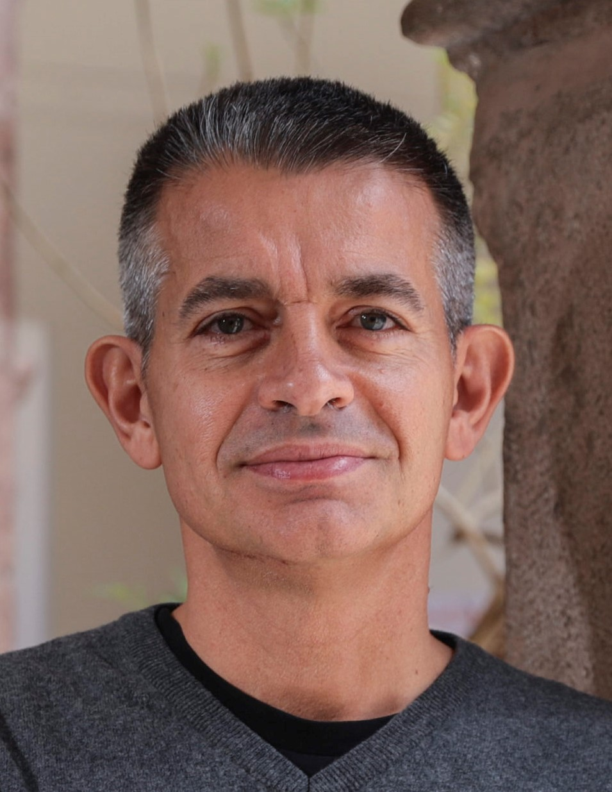
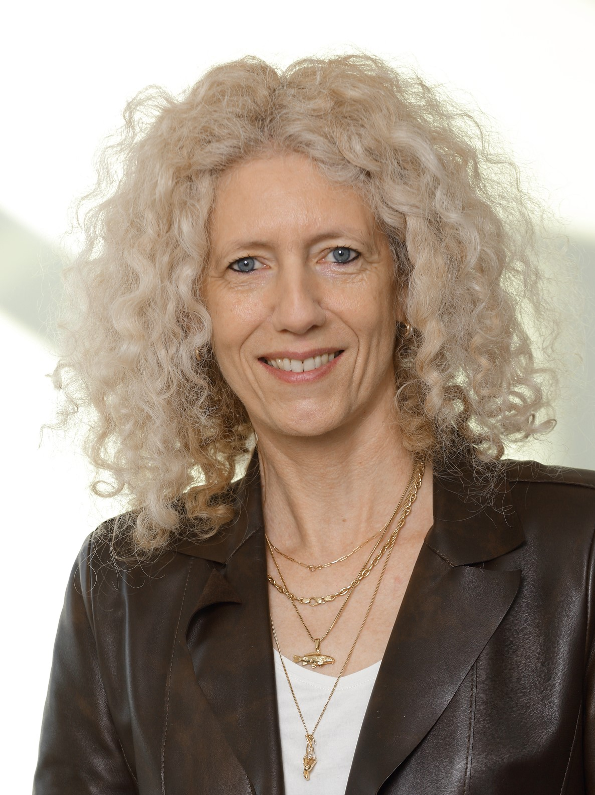

## Wednesday, September 7 -- 9:30 - 10:30

    Mempools: The Rise of Tightly Coupled Processor Clusters 
    Luca Benini 
    ETH Zurich 

 

### Abstract
In the quest for computing efficiency in a regime of diminishing returns from technology scaling, we must minimize data copies and the overheads associated with data transfer, data-flow management as well as instruction fetching. To achieve this goal, it is useful to take a  "mempool" viewpoint, i.e. shifting focus from optimizing the amount of memory to be placed "close" to a processor, to optimizing the amount of processors to be pooled around a memory. In this talk I share insights gained in designing open-source RISC-V hardware and software for energy-efficient computing based on the mempool concept, moving from single die to multiple chiplet systems.

### Biography
Luca Benini holds the chair of digital Circuits and systems at ETHZ and is Full Professor at the Universita di Bologna. He received a PhD from Stanford University. He has been visiting professor at Stanford University, IMEC, EPFL. He has worked in Synopsys,  Hewlett-Packard Labs and he served as chief architect in STmicroelectronics France. Dr. Benini’s research interests are in energy-​efficient parallel computing systems, smart sensing
micro-​systems and machine learning hardware. He has published more than 1000 peer-​reviewed papers and five books. He is a Fellow of the IEEE, of the ACM and a member of the Academia Europaea. He is the recipient of  the 2016 IEEE CAS Mac Van Valkenburg award, the 2020 EDAA achievement Award and the 2020 ACM/IEEE A. Richard Newton Award.

## Thursday, September 8 -- 9:30 - 10:30

    Integrating Quantum Computers in HPC Infrastructures 
    Kristel Michielsen 
    Jülich Supercomputing Centre, RWTH Aachen University 

 

### Abstract
For practical quantum computing, HPC infrastructures shall integrate quantum computers and simulators (QCS) in addition to cloud access to stand-alone QCS.

As longterm experience in conventional supercomputing demonstrate, the successful integration of QCS into HPC systems requires a focus on all three fundamental components of the HPC ecosystem: users and their applications, software, and hardware.

A broad user community will need to invest time and effort in developing new kinds of algorithms and software for real-world applications that take full advantage of the QCS as accelerators that speed up existing classical algorithms and software. In addition, a QCS full software stack will have to be developed that takes into account the various kinds of QCS hardware that is implemented on a variety of qubit platforms.

Finally, the development of use cases in a co-design approach with "hybrid" computing architectures in mind, will make it possible to address research challenges that cannot be met with current HPC architectures.

The High Performance Computer and Simulator hybrid (HPCQS) infrastructure, the pan-European hybrid HPC/quantum infrastructure supported by the European High-Performance Computing Joint Undertaking (EuroHPC JU) and six European countries (Austria, France, Germany, Ireland, Italy and Spain) realizes, after the Jülich UNified Infrastructure for Quantum computing (JUNIQ), a second step towards a European Quantum Computing and Simulation Infrastructure (EuroQCS), as advocated for in the Strategic Research Agenda of the European Quantum Flagship.

### Biography
Prof. Dr. Kristel Michielsen is group leader of the Quantum
Information Processing group at the Jülich Supercomputing
Centre (JSC), Forschungszentrum Jülich and Professor of
Quantum Information Processing at RWTH Aachen University.
Kristel Michielsen and her group have ample experience in
performing large-scale simulations of quantum systems. With
her group and a team of international collaborators, she set the
world record in simulating a quantum computer (QC) with 48
qubits. In 2019, she participated in a research collaboration that
proved Google’s quantum supremacy. She is building up the Jülich
UNified Infrastructure for Quantum computing (JUNIQ) at the
JSC. Her research interests range from classical simulations of
electrodynamics and quantum mechanics to quantum computing and quantum computing
architectures.

[Slides]()

## Friday, September 9 -- 9:30 - 10:30

    Matrices in Deep Neural Networks and How to Compute Them in Parallel 
    Rio Yokota 
    Tokyo Institute of Technology 

 

### Abstract
Large dense matrices such as Hessian, Gauss-Netwon, Fisher, Jacobian, and Kernel matrices are not only used for optimization, but also play a crucial role in generalization measures, variational inference, hyperparameter optimization, pruning, and initialization. However, these matrices are typically dense and have dimensions of the number of parameters, which is in the order of billions for modern deep neural networks. Because the exact computation of these matrices is intractable even on the largest supercomputers of today, various approximations have been proposed. These different approximations lead to new forms of parallelism, which make it possible to compute these matrices accurately with minimum overhead. In this talk, I will give an overview of the various matrices that appear in deep learning and how to approximate and parallelize their computation.

### Biography
Rio Yokota is an Associate Professor at the Global Scientific Information and Computing Center, Tokyo Institute of Technology. His research interests lie at the intersection of high performance computing, linear algebra, and machine learning. He is the developer numerous libraries for fast multipole methods (ExaFMM), hierarchical low-rank algorithms (Hatrix), and information matrices in deep learning (ASDFGHJKL) that scale to the full system on the largest supercomputers today. He has been optimizing algorithms on GPUs since 2006, and was part of a team that received the Gordon Bell prize in 2009 using the first GPU supercomputer.

[Slides]()